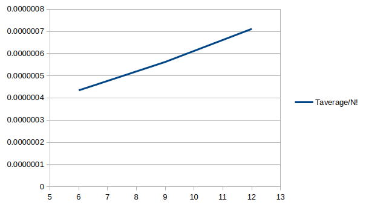
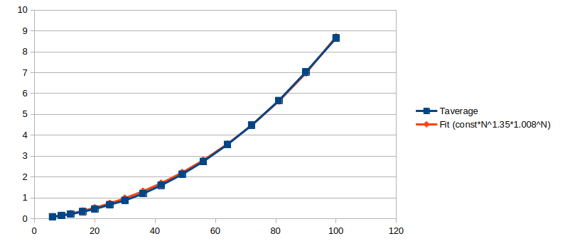

# placetest

This repository contains implementations for the following standard cell placement algorithms:

* Exhaustive search with factorial time complexity
* A simulated annealing algorithm which I presume is, in essence, very similar to what Intel might've used to design the i386 processor, the rest being history

Building the project requires a system running Linux and [libsodium](https://doc.libsodium.org/doc). Generating random numbers using libsodium is probably not exactly ideal for performance, as the project obviously doesn't a require a CSPRNG, but I caried over a lot of code from [passutil](https://github.com/Nullcaller/passutil), so I used it for the sake of expedience. You should be able to install libsodium for development by performing `apt install libsodium-dev` or an equivalent command for your Linux distribution.

To build the project and launch the executable, navigate to the cloned git repository and simply execute:

```
cmake .
make
./placetest
```

Configuration define statements are available in `src/flags.h` and `src/config.h`, while `src/placetest.c` is the main source file, linking all other sources and containing the `main` function.

## Assumptions and Simplifications

So as not to go too deep into the woods of standard cell placement shenanigans and make this project possible to implement (and run) in a timely manner, a number of key assumptions and simplifications were made.

These I would classify as 'assumptions':

* Chip designs are generated randomly, and thus make no actual sense and aren't grounded in reality
* IO cells are pre-placed in a ring around the functional cell area, each connecting to a pre-determined number of random functional cells (this is quite typical of actual semiconductor devices)
* Functional cells each have a random number of connections, with a certain pre-determined target average connection count per single functional cell
* There are exactly as many functional cells as there are places for the functional cells
* The distance between the cells is the [Manhattan norm](https://en.wikipedia.org/wiki/Taxicab_geometry) of a vector between their centers, also known as `abs(x1-x2)+abs(y1-y2)` (this is just actually how that works in semiconductor devices because of how metallization layers are arranged)

And these I would classify as 'simplifications':

* The grid and the standard cells are square (which means everything is just integer math, which is good for the CPU)
* The standard cells don't have physical locations for inputs/outputs, it is assumed that all connections are made to the center of the standard cell
* The value being optimized by the algorithms in this project is the total length of wire inside the chip, i.e. the sum of lengths of all connections, which I assume isn't the case for real semiconductor devices, as they would probably be optimized for the shortest length of the longest path instead (to reduce the maximum delay and increase the clocking frequency), but as finding the longest path is in and of itself an NP-hard problem, I decided not to tackle it here

## The Annealing Algorithm

The implemented annealing algorithm takes three arguments: starting temperature, temperature schedule and the timeout parameter. The temperature schedule argument is meant to be independent of cell count, i.e. yield roughly the same results at different cell counts. To that end, it is scaled down proportionally to the number of cells, so as to ensure the percentage of cells swapped at a given temperature stays approximately the same as the cell number changes.

On each iteration of the algorithm, two random cells are swapped, and the optimization metric (lower is better) for the resultant chip design is calculated. If optimization metric changed upwards by a value that's smaller than the temperature, the temperature decreases by a certain value, set by the temperature schedule. If, on the other hand, the change of optimization metric is larger than the temperature, the swap is reversed, and the procedure is tried again, and again, and again. However, after the number of tries exceeds the value of the timeout parameter, the algorithm gives up and decreases the temperature. In any case, the algorithm moves on to the next iteration.

Once the temperature hits zero, within the floating point margin of error, the algorithm is done and the cell placement is commited into the chip structure.

The motivation for the overall structure of the algorithm is fairly simple. The gradual lowering of the temperature allows us to spend some time on escaping the local minimums of the optimization criteria, while multiple tries for each swap potentially allow to actually find a valid swap in the myriads of possible swap pairs.   

## Results

The `data` folder contains some output logs (with config & flags values used to obtain them) similar to the ones you might get if you build and run the project. The main results are:

* Near-factorial scaling was observed for the bruteforce exhaustive search algorithm
* Most optimal annealing schedule seems to be -0.05/N, with returns diminishing swiftly after that point
* Near-polynomial scaling was observed for the simulated annealing algorithm with the optimal annealing schedule

Moreover, the two algorithms seem to yield sensible results in relation to each other. For instance, for a 3x3 functional area chip:

* Bruteforce algorithm always yields a result that is as at least as good as or better than the result of the annealing algorithm
* The results of the annealing algorithm are always near the results of the bruteforce algorithm, sometimes slightly worse
* Relative deviation from the bruteforce-derived optimum for the annealing algorithm does not exceed ~5%
* Deviation from the bruteforce-derived optimum relative to the maximum possible range of deviation (`disoptimum-optimum`) does not exceed ~10%

These observations are the result of running the sanity check part of the project 20-30 times, and in my mind provide a conclusive, if indirect, proof of correctness for algorithm implementations.

To better illustrate the time complexity of the implemented algorithms, here are the graphs of execution time as a function of the number of functional cells, for the bruteforce and the annealing algorithms, respectively (data and graphs available in `data/placetest_complexity.ods`):





For the bruteforce algorithm, the expected time complexity is, of course, `O(N!)`, while for the annealing algorithm it should be anywhere from `O(N)` in the best case scenario to `O(N^2)` in the worst case scenario. The observed time complexities, however, are slightly worse in both cases.

I'm not entirely sure what the exact reason for that is, but to me it seems like it would probably be hardware-related, like CPU boost frequency decreasing over time or increased functional area size leading to increasingly non-local computations and therefore more cache misses. 

## Where This Leaves Us

Modern tools for standard cell placement have evolved significantly since Intel's TimberWolf made its debut. The algorithm implementations presented in this repository certainly have room for improvement. But even assuming a 10x improvement in base speed, an optimistic time complexity of `O(N^1,33)` and a perfect parallelization of the workflow to a 200-core system, it will take almost an entire day to place some 10 million standard cells, which is a fairly modest amount by today's standards. And keep in mind that placement is just _one_ of the steps in semiconductor design. You also need to route all of the standard cell connections, then evaluate the design for design rule violations, constraint violations, optimization possibilities...

Now, the actual state-of-the-art placement algorithms used in actual software used to design production silicon are closely-guarded trade secrets. But if we go off what [Wikipedia](https://en.wikipedia.org/wiki/Placement_(electronic_design_automation)#Basic_techniques) has to say about the modern placement algorithms, it seems to me like they all rely on the fact that, in real silicon, connections between cells are usually clustered. If you were to somehow build a human-readable graph of what a modern chip looks like, you'd probably see long _chains_ of logic connecting to a few independent blobs. This means that the task of optimizing placement can be split into optimizing global and local placement, separately.

Implementing such an algorithm would be an interesting challenge. But it is far out of scope of this project. For one, it wouldn't even really be comparable to the algorithms implemented here. Completing an exhaustive search on the simplest of topologies for which it would make sense to use such an algorithm, would probably be impossible, and even the annealing algorithm would probably take a very long time. The aforementioned 200-core system is, alas, not something I really have access to.

### Literature

* [Ken Shirriff's blog: Reverse engineering standard cell logic in the Intel 386 processor](https://www.righto.com/2024/01/intel-386-standard-cells.html)
* [VLSI Cell Placement Techniques (K. Shahookar and P. Mazumder)](doc/cellplacement.pdf)
* [Performance of a parallel algorithm for standard cell placement (Mark Jones and Prithviraj Banerjee)](doc/parallel-annealing.pdf)
* [Graywolf, a fork of the last open-source version of TimberWolf](https://github.com/rubund/graywolf)
* [qflow, an open-source digital synthesis flow](http://www.opencircuitdesign.com/qflow/)
* [TimberWolf documentation](doc/TimberWolf-doc.pdf)
* [TimberWolf 3.2 paper](doc/timberwolf.pdf)

